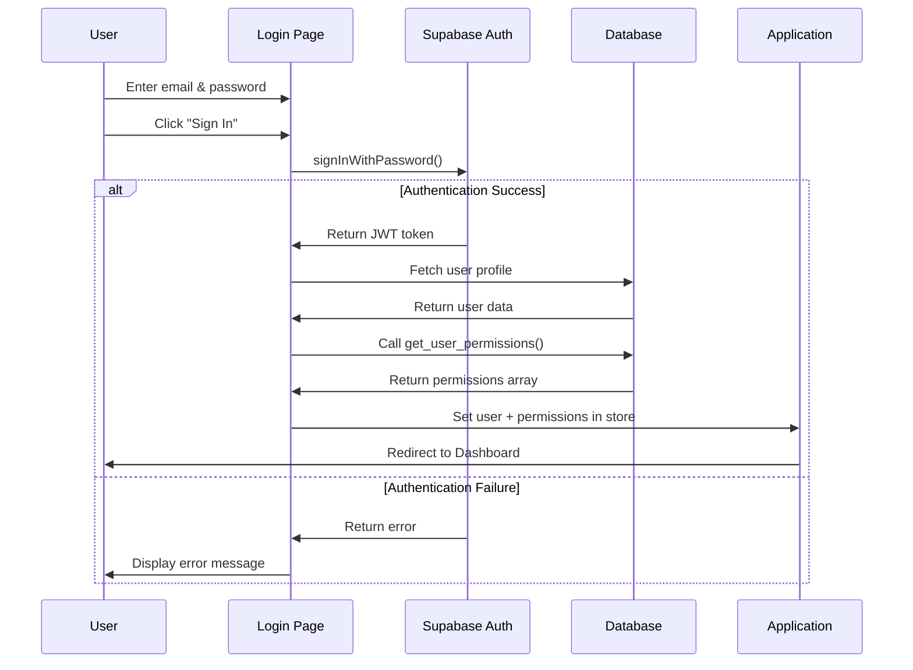
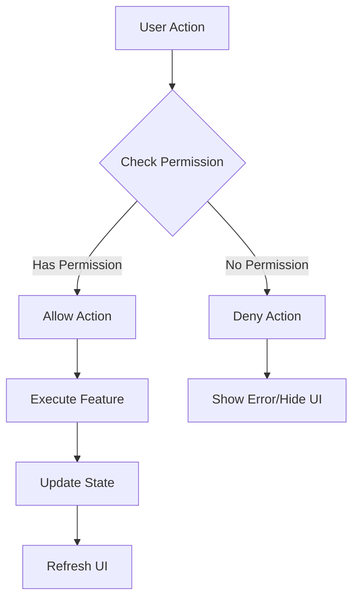
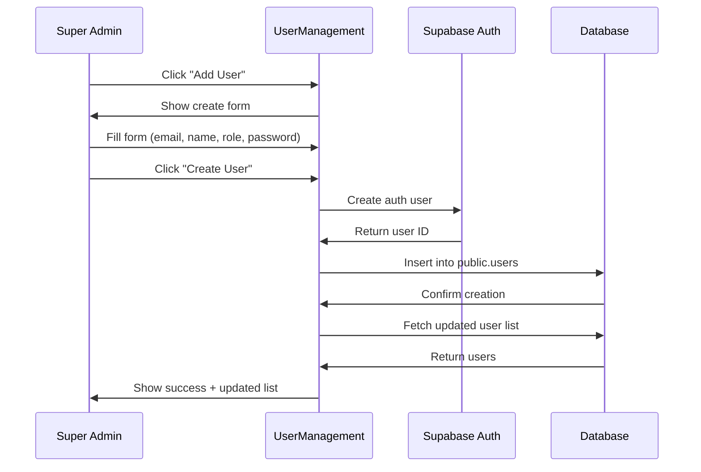

# Authentication & Authorization System

## Feature Overview

### Purpose
Secure JWT-based authentication system with role-based access control (RBAC) for the TeleFlow application, enabling granular permission management across different user roles.

### Key Capabilities
- Email/password authentication via Supabase Auth
- JWT token-based session management
- Role-based access control (6 predefined roles)
- Feature-level permission assignment
- Super admin user management
- Dynamic permission checking

### User Roles
1. **Super Admin** - Full system access, can manage users and permissions
2. **Admin** - Site and team management
3. **Project Manager (PM)** - Project and task oversight
4. **Team Lead** - Team coordination and task assignment
5. **Member** - Standard user access
6. **Tech** - Technical field operations

---

## Technical Architecture

### Component Hierarchy
```
App.tsx
├── Login.tsx (unauthenticated)
└── Layout.tsx (authenticated)
    ├── UserManagement.tsx (super_admin only)
    └── Protected Routes
```

### State Management (Zustand)
```typescript
interface AuthState {
  currentUser: User | null;
  userPermissions: string[];
  isLoading: boolean;
  error: string | null;
  
  // Actions
  login: (email: string, password: string) => Promise<void>;
  logout: () => Promise<void>;
  checkAuth: () => Promise<void>;
  fetchUserPermissions: (userId: string) => Promise<void>;
}
```

### Key Files
- [`src/lib/supabase.ts`](file:///d:/telflow/teleflow/src/lib/supabase.ts) - Supabase client and auth helpers
- [`src/lib/auth.ts`](file:///d:/telflow/teleflow/src/lib/auth.ts) - Permission utilities
- [`src/lib/store.ts`](file:///d:/telflow/teleflow/src/lib/store.ts) - Auth state management
- [`src/pages/Login.tsx`](file:///d:/telflow/teleflow/src/pages/Login.tsx) - Login UI
- [`src/pages/UserManagement.tsx`](file:///d:/telflow/teleflow/src/pages/UserManagement.tsx) - User admin UI

---

## Database Schema

### Tables

#### `auth.users` (Supabase Auth)
Built-in Supabase authentication table.

| Column | Type | Description |
|--------|------|-------------|
| id | uuid | Primary key |
| email | text | User email (unique) |
| encrypted_password | text | Hashed password |
| created_at | timestamptz | Account creation time |
| last_sign_in_at | timestamptz | Last login time |

#### `public.users`
Extended user profile information.

| Column | Type | Constraints | Description |
|--------|------|-------------|-------------|
| id | uuid | PK, FK → auth.users | User ID |
| name | text | NOT NULL | Full name |
| email | text | UNIQUE, NOT NULL | Email address |
| role | text | NOT NULL | User role |
| avatar | text | | Profile picture URL |
| created_at | timestamptz | DEFAULT now() | Profile creation |
| updated_at | timestamptz | DEFAULT now() | Last update |

**Indexes:**
- `idx_users_email` on `email`
- `idx_users_role` on `role`

**RLS Policies:**
- Users can read their own profile
- Super admins can read all profiles
- Super admins can create/update/delete users

#### `public.permissions`
Defines all available system permissions.

| Column | Type | Constraints | Description |
|--------|------|-------------|-------------|
| id | uuid | PK, DEFAULT uuid_generate_v4() | Permission ID |
| name | text | UNIQUE, NOT NULL | Permission identifier |
| description | text | | Human-readable description |
| category | text | NOT NULL | Permission grouping |
| created_at | timestamptz | DEFAULT now() | Creation time |

**Default Permissions:**
```sql
-- Site Management
'sites.view', 'sites.create', 'sites.edit', 'sites.delete'

-- Task Management  
'tasks.view', 'tasks.create', 'tasks.edit', 'tasks.delete', 'tasks.assign'

-- Workflow Management
'workflows.view', 'workflows.create', 'workflows.edit', 'workflows.delete', 'workflows.execute'

-- Document Management
'documents.view', 'documents.upload', 'documents.edit', 'documents.delete'

-- Team Management
'team.view', 'team.invite', 'team.edit', 'team.remove'

-- User Management
'users.view', 'users.create', 'users.edit', 'users.delete', 'users.manage_permissions'

-- Analytics
'analytics.view', 'analytics.export'

-- Settings
'settings.view', 'settings.edit'
```

#### `public.role_permissions`
Maps permissions to roles.

| Column | Type | Constraints | Description |
|--------|------|-------------|-------------|
| id | uuid | PK, DEFAULT uuid_generate_v4() | Mapping ID |
| role | text | NOT NULL | Role name |
| permission_id | uuid | FK → permissions | Permission reference |
| created_at | timestamptz | DEFAULT now() | Assignment time |

**Unique Constraint:** `(role, permission_id)`

#### `public.user_custom_permissions`
User-specific permission overrides.

| Column | Type | Constraints | Description |
|--------|------|-------------|-------------|
| id | uuid | PK, DEFAULT uuid_generate_v4() | Override ID |
| user_id | uuid | FK → users | User reference |
| permission_id | uuid | FK → permissions | Permission reference |
| granted | boolean | NOT NULL | Grant or revoke |
| created_at | timestamptz | DEFAULT now() | Override time |

**Unique Constraint:** `(user_id, permission_id)`

### Database Functions

#### `get_user_permissions(user_uuid uuid)`
Returns array of permission names for a user.

```sql
CREATE OR REPLACE FUNCTION get_user_permissions(user_uuid uuid)
RETURNS text[] AS $$
DECLARE
  user_role text;
  permissions text[];
BEGIN
  -- Get user's role
  SELECT role INTO user_role FROM public.users WHERE id = user_uuid;
  
  -- Get role permissions
  SELECT array_agg(DISTINCT p.name) INTO permissions
  FROM public.permissions p
  JOIN public.role_permissions rp ON p.id = rp.permission_id
  WHERE rp.role = user_role;
  
  -- Apply custom permissions
  -- (grants add, revokes remove)
  
  RETURN permissions;
END;
$$ LANGUAGE plpgsql SECURITY DEFINER;
```

---

## User Flows

### 1. User Login Flow



### 2. Permission Check Flow



### 3. User Creation Flow (Super Admin)



---

## API Integration

### Supabase Auth Methods

#### Sign In
```typescript
const { data, error } = await supabase.auth.signInWithPassword({
  email: 'user@example.com',
  password: 'password123'
});
```

#### Sign Up
```typescript
const { data, error } = await supabase.auth.signUp({
  email: 'newuser@example.com',
  password: 'password123',
  options: {
    data: {
      name: 'John Doe',
      role: 'member'
    }
  }
});
```

#### Sign Out
```typescript
const { error } = await supabase.auth.signOut();
```

#### Get Current User
```typescript
const { data: { user } } = await supabase.auth.getUser();
```

### Database Queries

#### Fetch User Profile
```typescript
const { data, error } = await supabase
  .from('users')
  .select('*')
  .eq('id', userId)
  .single();
```

#### Get User Permissions
```typescript
const { data, error } = await supabase
  .rpc('get_user_permissions', { user_uuid: userId });
// Returns: ['sites.view', 'tasks.create', ...]
```

#### Create User Profile
```typescript
const { data, error } = await supabase
  .from('users')
  .insert({
    id: authUserId,
    name: 'John Doe',
    email: 'john@example.com',
    role: 'member'
  });
```

---

## Permission Utilities

### Check Permission
```typescript
import { hasPermission } from '@/lib/auth';

// In component
const canEditSites = hasPermission(userPermissions, 'sites.edit');

if (canEditSites) {
  // Show edit button
}
```

### Check Role
```typescript
import { hasRole, isSuperAdmin } from '@/lib/auth';

const isAdmin = isSuperAdmin(currentUser);
const isPM = hasRole(currentUser, 'pm');
```

### Can Access Feature
```typescript
import { canAccess } from '@/lib/auth';

const canAccessUserMgmt = canAccess(currentUser, userPermissions, {
  roles: ['super_admin'],
  permissions: ['users.view']
});
```

---

## Security Considerations

### Row-Level Security (RLS)
All tables have RLS enabled with policies based on user roles and permissions.

### Password Requirements
- Minimum 8 characters
- Must contain uppercase, lowercase, number, and special character
- Enforced by Supabase Auth

### JWT Token Management
- Tokens auto-refresh before expiration
- Stored in httpOnly cookies (Supabase default)
- 1-hour expiration, 7-day refresh token

### Permission Caching
- Permissions fetched on login and cached in Zustand store
- Re-fetched on permission changes
- Validated server-side via RLS

---

## Error Handling

### Common Errors

| Error | Cause | Resolution |
|-------|-------|------------|
| Invalid login credentials | Wrong email/password | Show error message |
| Email already exists | Duplicate signup | Prompt to login instead |
| Insufficient permissions | User lacks required permission | Hide feature or show error |
| Session expired | JWT token expired | Auto-refresh or redirect to login |

---

## Testing Checklist

- [ ] Super admin can login
- [ ] Super admin can create users with different roles
- [ ] Users can login with created credentials
- [ ] Permissions are correctly assigned per role
- [ ] RLS policies prevent unauthorized access
- [ ] Session persists across page refreshes
- [ ] Logout clears session properly
- [ ] Password reset flow works
- [ ] Permission checks hide/show UI elements correctly
