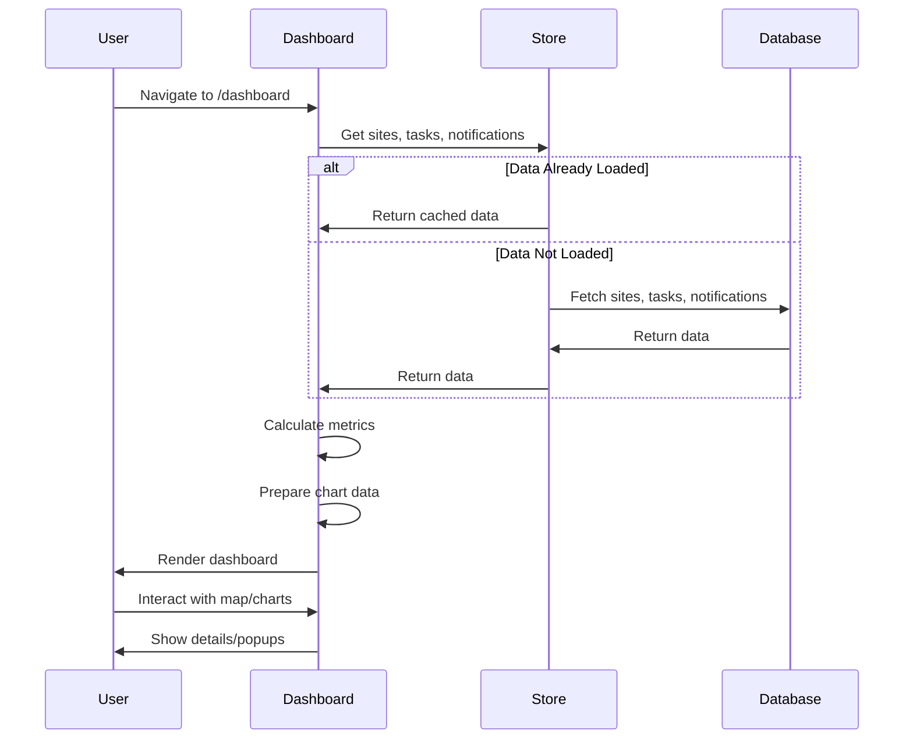
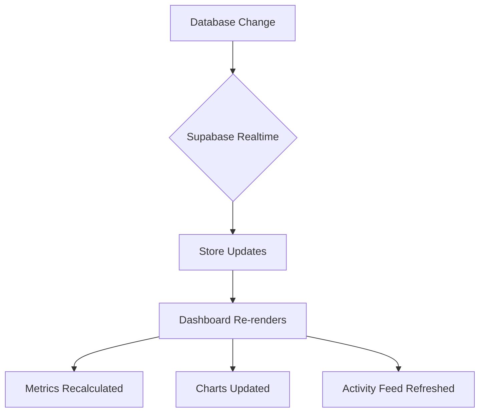

# Dashboard - Command Center

## Feature Overview

### Purpose
Centralized command center providing real-time visibility into site operations, team workload, active alarms, and key metrics through interactive visualizations and a live activity feed.

### Key Capabilities
- Real-time metrics display (sites, alarms, maintenance, lease expirations)
- Interactive charts (task distribution pie chart, team workload bar chart)
- Geographic site visualization with interactive map
- Live activity feed with notifications
- System status monitoring

### User Roles
- **All authenticated users** can view the dashboard
- Metrics filtered based on user permissions

---

## Technical Architecture

### Component Structure
```
Dashboard.tsx
├── Metrics Cards (4 cards)
├── Charts Section
│   ├── PieChart (Task Distribution)
│   └── BarChart (Team Workload)
└── Map + Activity Feed
    ├── Leaflet Map (Site Markers)
    └── Activity Feed (Notifications)
```

### Dependencies
- **Recharts** - Chart visualizations
- **React-Leaflet** - Interactive maps
- **date-fns** - Date formatting
- **Zustand** - State management

### State Management
```typescript
// From useStore()
const {
  sites,           // Site[] - All sites
  notifications,   // Notification[] - Activity feed
  tasks,          // Task[] - For metrics
  currentUser     // User - Current logged-in user
} = useStore();
```

### Key Files
- [`src/pages/Dashboard.tsx`](file:///d:/telflow/teleflow/src/pages/Dashboard.tsx) - Main dashboard component

---

## Database Schema

### Tables Used

#### `public.sites`
| Column | Type | Description |
|--------|------|-------------|
| id | uuid | Site ID |
| name | text | Site name |
| status | text | operational/maintenance/offline |
| lat | numeric | Latitude |
| lng | numeric | Longitude |
| tenant | text | Tenant name |
| lease_expires | date | Lease expiration date |

#### `public.tasks`
| Column | Type | Description |
|--------|------|-------------|
| id | uuid | Task ID |
| status | text | todo/in_progress/review/completed |
| assignee_id | uuid | Assigned user |
| priority | text | urgent/high/medium/low |

#### `public.notifications`
| Column | Type | Description |
|--------|------|-------------|
| id | uuid | Notification ID |
| type | text | error/warning/success/info |
| title | text | Notification title |
| message | text | Notification message |
| timestamp | timestamptz | Creation time |
| read | boolean | Read status |

---

## Dashboard Metrics

### 1. Active Sites
```typescript
const totalSites = sites.length;
```
- **Icon**: Server (blue)
- **Color**: Blue (#3b82f6)
- **Source**: Count of all sites

### 2. Active Alarms
```typescript
const activeAlarms = notifications.filter(n => n.type === 'error').length;
```
- **Icon**: AlertTriangle (rose)
- **Color**: Rose/Red (#ef4444)
- **Source**: Error-type notifications

### 3. In Maintenance
```typescript
const maintenanceSites = sites.filter(s => s.status === 'maintenance').length;
```
- **Icon**: Activity (amber)
- **Color**: Amber/Orange (#f59e0b)
- **Source**: Sites with maintenance status

### 4. Lease Expirations (30 Days)
```typescript
const leaseExpirations = sites.filter(s => 
  new Date(s.leaseExpires) < new Date(Date.now() + 30 * 24 * 60 * 60 * 1000)
).length;
```
- **Icon**: Clock (emerald)
- **Color**: Emerald/Green (#10b981)
- **Source**: Sites with leases expiring within 30 days

---

## Chart Visualizations

### Task Distribution (Pie Chart)
```typescript
const statusData = [
  { 
    name: 'Planning', 
    value: tasks.filter(t => t.status === 'planning').length, 
    color: '#6366f1' 
  },
  { 
    name: 'Permitting', 
    value: tasks.filter(t => t.status === 'permitting').length, 
    color: '#8b5cf6' 
  },
  { 
    name: 'Construction', 
    value: tasks.filter(t => t.status === 'construction').length, 
    color: '#ec4899' 
  },
  { 
    name: 'Integration', 
    value: tasks.filter(t => t.status === 'integration').length, 
    color: '#14b8a6' 
  },
  { 
    name: 'Live', 
    value: tasks.filter(t => t.status === 'live').length, 
    color: '#10b981' 
  },
];
```

**Visualization**: Donut chart with custom colors
- Inner radius: 60px
- Outer radius: 80px
- Padding angle: 5°

### Team Workload (Bar Chart)
```typescript
const userData = [
  { name: 'Alice', tasks: tasks.filter(t => t.assigneeId === 'u1').length },
  { name: 'Bob', tasks: tasks.filter(t => t.assigneeId === 'u2').length },
  { name: 'Charlie', tasks: tasks.filter(t => t.assigneeId === 'u3').length },
  { name: 'David', tasks: tasks.filter(t => t.assigneeId === 'u4').length },
  { name: 'Eve', tasks: tasks.filter(t => t.assigneeId === 'u5').length },
];
```

**Visualization**: Vertical bar chart
- X-axis: User names
- Y-axis: Task count
- Bar color: Blue (#3b82f6)
- Rounded corners: 4px top

---

## Interactive Map

### Configuration
```typescript
<MapContainer 
  center={[40.7128, -74.0060]}  // NYC coordinates
  zoom={10}
  style={{ height: '100%', width: '100%' }}
>
  <TileLayer
    url="https://{s}.basemaps.cartocdn.com/dark_all/{z}/{x}/{y}{r}.png"
  />
</MapContainer>
```

### Site Markers
```typescript
sites.map(site => (
  <Marker key={site.id} position={[site.lat, site.lng]}>
    <Popup>
      <h3>{site.name}</h3>
      <p>Status: {site.status}</p>
      <p>Tenant: {site.tenant}</p>
    </Popup>
  </Marker>
))
```

**Marker Icons**: Default Leaflet markers
**Popup Trigger**: Click on marker

---

## Activity Feed

### Notification Display
```typescript
notifications.map(notification => (
  <div className="notification-item">
    <Icon type={notification.type} />
    <div>
      <h4>{notification.title}</h4>
      <p>{notification.message}</p>
      <span>{formatDistanceToNow(new Date(notification.timestamp))}</span>
    </div>
  </div>
))
```

### Icon Mapping
| Type | Icon | Color |
|------|------|-------|
| error | AlertTriangle | Rose (#ef4444) |
| warning | Clock | Amber (#f59e0b) |
| success | CheckCircle | Emerald (#10b981) |
| info | Activity | Blue (#3b82f6) |

---

## User Flow

### Dashboard Load Flow



### Real-time Updates Flow



---

## API Integration

### Fetch Dashboard Data
```typescript
// On component mount or data refresh
const { data: sites } = await supabase.from('sites').select('*');
const { data: tasks } = await supabase.from('tasks').select('*');
const { data: notifications } = await supabase
  .from('notifications')
  .select('*')
  .order('timestamp', { ascending: false })
  .limit(20);
```

### Real-time Subscriptions (Optional)
```typescript
// Subscribe to site changes
const siteSubscription = supabase
  .channel('sites-changes')
  .on('postgres_changes', 
    { event: '*', schema: 'public', table: 'sites' },
    (payload) => {
      // Update store with new data
    }
  )
  .subscribe();
```

---

## Performance Optimizations

### Data Caching
- Dashboard data cached in Zustand store
- Only refetches on explicit refresh or navigation

### Lazy Loading
- Charts render only when data is available
- Map tiles load on demand

### Memoization
```typescript
const statusData = useMemo(() => {
  return [
    { name: 'Planning', value: tasks.filter(t => t.status === 'planning').length },
    // ...
  ];
}, [tasks]);
```

---

## Responsive Design

### Breakpoints
- **Mobile** (< 768px): Single column layout
- **Tablet** (768px - 1024px): 2-column metrics, stacked charts
- **Desktop** (> 1024px): 4-column metrics, side-by-side charts

### Grid Layout
```css
/* Metrics */
grid-cols-1 md:grid-cols-2 lg:grid-cols-4

/* Charts */
grid-cols-1 lg:grid-cols-2

/* Map + Activity */
grid-cols-1 lg:grid-cols-3
```

---

## Testing Checklist

- [ ] Metrics display correct counts
- [ ] Charts render with accurate data
- [ ] Map shows all sites with correct coordinates
- [ ] Markers display popup on click
- [ ] Activity feed shows recent notifications
- [ ] Responsive layout works on all screen sizes
- [ ] Real-time updates reflect in dashboard
- [ ] Performance is acceptable with 100+ sites
