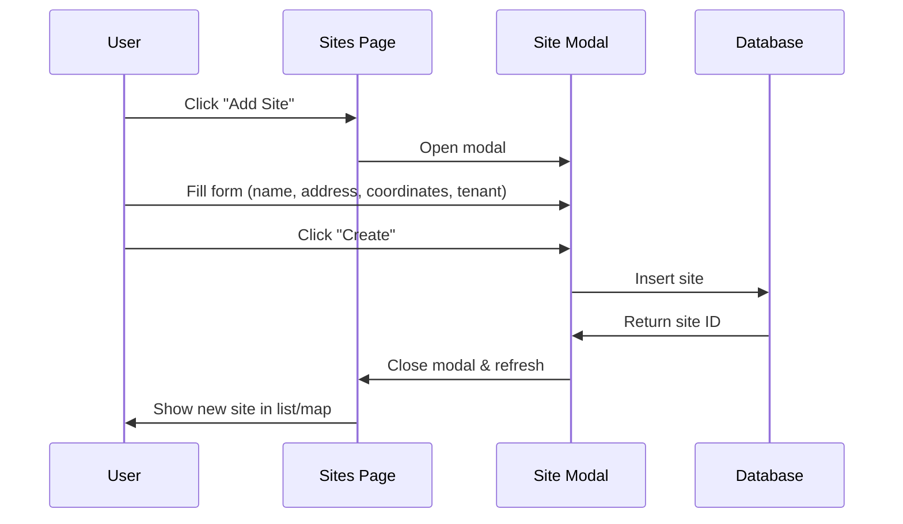

# Site Management

## Feature Overview

### Purpose
Manage cell tower sites including location tracking, status monitoring, tenant information, and lease management.

### Key Capabilities
- Site CRUD operations
- Geographic visualization on map
- Status tracking (operational/maintenance/offline)
- Tenant and lease management
- Site-specific task and document linking

### User Roles & Permissions
- **View**: Users with `sites.view` permission
- **Create/Edit**: Users with `sites.create`, `sites.edit` permissions
- **Delete**: Users with `sites.delete` permission

---

## Database Schema

### `public.sites`
| Column | Type | Constraints | Description |
|--------|------|-------------|-------------|
| id | uuid | PK | Site ID |
| name | text | NOT NULL | Site name |
| address | text | NOT NULL | Physical address |
| lat | numeric | NOT NULL | Latitude |
| lng | numeric | NOT NULL | Longitude |
| status | text | NOT NULL | operational/maintenance/offline |
| tenant | text | | Tenant name |
| lease_start | date | | Lease start date |
| lease_expires | date | | Lease expiration |
| monthly_cost | numeric | | Monthly lease cost |
| site_type | text | | macro/micro/small_cell |
| equipment | jsonb | | Equipment details |
| created_at | timestamptz | DEFAULT now() | Creation time |
| updated_at | timestamptz | DEFAULT now() | Last update |

**Indexes:**
- `idx_sites_status` on `status`
- `idx_sites_location` on `(lat, lng)` (GiST index for geospatial queries)

---

## User Flows

### Create Site Flow


---

## API Integration

### Fetch Sites
```typescript
const { data, error } = await supabase
  .from('sites')
  .select('*')
  .order('name', { ascending: true });
```

### Create Site
```typescript
const { data, error } = await supabase
  .from('sites')
  .insert({
    name: 'Tower NYC-001',
    address: '123 Main St, New York, NY',
    lat: 40.7128,
    lng: -74.0060,
    status: 'operational',
    tenant: 'Verizon',
    lease_start: '2024-01-01',
    lease_expires: '2029-01-01',
    monthly_cost: 5000
  });
```

---

## Testing Checklist
- [ ] Can create sites with all fields
- [ ] Sites display on map with correct coordinates
- [ ] Status updates reflect immediately
- [ ] Lease expiration warnings work
- [ ] Site filtering works correctly
