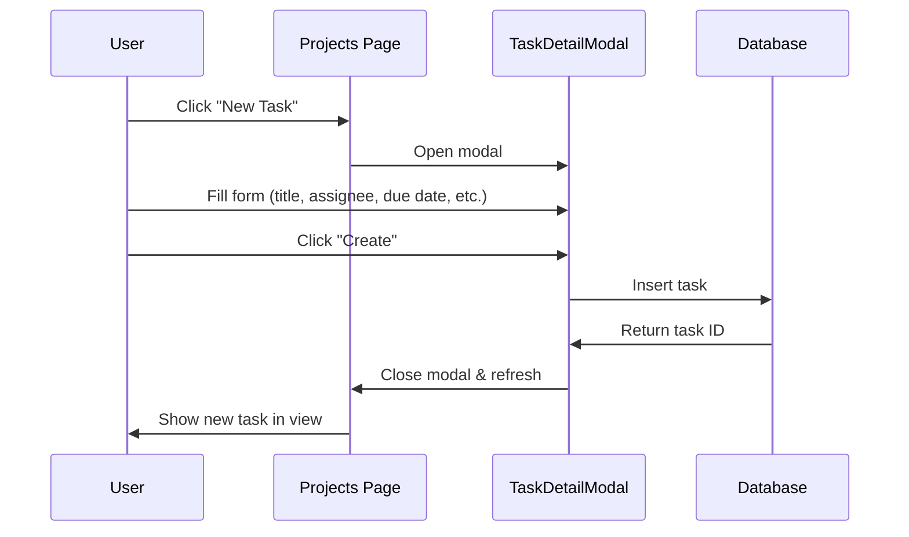
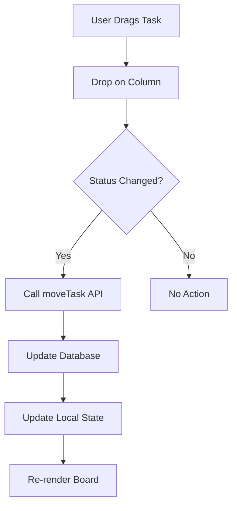
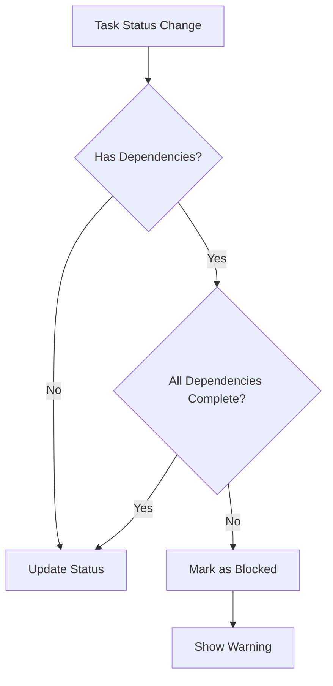

# Task & Project Management

## Feature Overview

### Purpose
Comprehensive task and project management system with multiple visualization modes (Kanban, List, Timeline, Calendar, Dependencies) for tracking and managing cell tower deployment tasks.

### Key Capabilities
- **5 View Modes**: Kanban board, List view, Calendar, Timeline (Gantt), Dependency graph
- Drag-and-drop task management
- Task filtering and bulk operations
- Subtask tracking with progress bars
- Task dependencies and blocking relationships
- Priority and status management
- Assignee management

### User Roles & Permissions
- **View**: All authenticated users
- **Create/Edit**: Users with `tasks.create`, `tasks.edit` permissions
- **Delete**: Users with `tasks.delete` permission
- **Assign**: Users with `tasks.assign` permission

---

## Technical Architecture

### Component Hierarchy
```
Projects.tsx (Main Container)
├── View Mode Selector
├── Filters & Bulk Actions
├── Kanban View
│   └── SortableTask components
├── TaskListView
├── TaskCalendarView
├── TaskTimelineView
├── DependencyGraph
└── TaskDetailModal
```

### State Management
```typescript
const {
  tasks,              // Task[] - All tasks
  moveTask,           // Move task between statuses
  updateTask,         // Update task properties
  deleteTask,         // Delete a task
  bulkUpdateTasks,    // Update multiple tasks
  bulkDeleteTasks     // Delete multiple tasks
} = useStore();
```

### Key Files
- [`src/pages/Projects.tsx`](file:///d:/telflow/teleflow/src/pages/Projects.tsx) - Main container
- [`src/components/tasks/TaskListView.tsx`](file:///d:/telflow/teleflow/src/components/tasks/TaskListView.tsx) - List view
- [`src/components/tasks/TaskCalendarView.tsx`](file:///d:/telflow/teleflow/src/components/tasks/TaskCalendarView.tsx) - Calendar
- [`src/components/tasks/TaskTimelineView.tsx`](file:///d:/telflow/teleflow/src/components/tasks/TaskTimelineView.tsx) - Timeline
- [`src/components/tasks/DependencyGraph.tsx`](file:///d:/telflow/teleflow/src/components/tasks/DependencyGraph.tsx) - Dependencies
- [`src/components/projects/TaskDetailModal.tsx`](file:///d:/telflow/teleflow/src/components/projects/TaskDetailModal.tsx) - Task details

---

## Database Schema

### `public.tasks`
| Column | Type | Constraints | Description |
|--------|------|-------------|-------------|
| id | uuid | PK | Task ID |
| title | text | NOT NULL | Task title |
| description | text | | Task description |
| status | text | NOT NULL | todo/in_progress/review/completed/blocked |
| priority | text | NOT NULL | urgent/high/medium/low |
| assignee_id | uuid | FK → users | Assigned user |
| site_id | uuid | FK → sites | Related site |
| story_id | uuid | FK → stories | Related story |
| due_date | date | NOT NULL | Deadline |
| start_date | date | | Start date |
| estimated_hours | numeric | | Estimated effort |
| actual_hours | numeric | | Actual time spent |
| dependencies | uuid[] | | Array of task IDs this depends on |
| tags | text[] | | Task tags |
| created_at | timestamptz | DEFAULT now() | Creation time |
| updated_at | timestamptz | DEFAULT now() | Last update |
| created_by | uuid | FK → users | Creator |

**Indexes:**
- `idx_tasks_status` on `status`
- `idx_tasks_assignee` on `assignee_id`
- `idx_tasks_site` on `site_id`
- `idx_tasks_due_date` on `due_date`

### `public.subtasks`
| Column | Type | Constraints | Description |
|--------|------|-------------|-------------|
| id | uuid | PK | Subtask ID |
| task_id | uuid | FK → tasks | Parent task |
| title | text | NOT NULL | Subtask title |
| completed | boolean | DEFAULT false | Completion status |
| assignee_id | uuid | FK → users | Assigned user |
| created_at | timestamptz | DEFAULT now() | Creation time |

**Index:** `idx_subtasks_task` on `task_id`

---

## View Modes

### 1. Kanban Board
**Layout**: 4 columns (To Do, In Progress, Review, Completed)

```typescript
const columns = [
  { id: 'todo', title: 'To Do', status: 'todo' },
  { id: 'in_progress', title: 'In Progress', status: 'in_progress' },
  { id: 'review', title: 'Review', status: 'review' },
  { id: 'completed', title: 'Completed', status: 'completed' },
];
```

**Features**:
- Drag-and-drop between columns
- Task count badges
- Priority color coding
- Due date display

**Drag & Drop**:
```typescript
import { DndContext, DragOverlay } from '@dnd-kit/core';
import { SortableContext, useSortable } from '@dnd-kit/sortable';

const handleDragEnd = (event: DragEndEvent) => {
  const { active, over } = event;
  const activeTask = tasks.find(t => t.id === active.id);
  const overColumn = columns.find(c => c.id === over.id);
  
  if (overColumn && activeTask.status !== overColumn.status) {
    moveTask(activeTask.id, overColumn.status);
  }
};
```

### 2. List View
**Layout**: Sortable table with columns

| Column | Description |
|--------|-------------|
| Checkbox | Multi-select |
| Task | Title + description |
| Status | Badge with icon |
| Priority | Flag icon with color |
| Assignee | User avatar + name |
| Due Date | Formatted date |
| Progress | Progress bar (based on subtasks) |

**Progress Calculation**:
```typescript
const progress = task.subtasks?.length > 0
  ? Math.round((task.subtasks.filter(st => st.completed).length / task.subtasks.length) * 100)
  : task.status === 'completed' ? 100 : 0;
```

### 3. Calendar View
**Layout**: Monthly calendar grid

**Features**:
- Tasks displayed on due dates
- Color-coded by priority
- Click to view details
- Multi-day task spanning

### 4. Timeline View (Gantt Chart)
**Layout**: Horizontal timeline with task bars

**Features**:
- Task duration visualization
- Dependency arrows
- Milestone markers
- Date range selection

### 5. Dependency Graph
**Layout**: Node-based graph using React Flow

**Features**:
- Visual dependency relationships
- Circular dependency detection
- Critical path highlighting
- Blocked task indicators

**Node Colors**:
- Blue: In Progress
- Green: Completed
- Red: Blocked
- Gray: Not Started

---

## Task Filtering

### Filter Options
```typescript
interface TaskFilterState {
  assignees: string[];      // Filter by assignee IDs
  priorities: string[];     // Filter by priority levels
  statuses: string[];       // Filter by status
  sites: string[];          // Filter by site IDs
  stories: string[];        // Filter by story IDs
  tags: string[];           // Filter by tags
  dateRange: {
    start?: string;
    end?: string;
  };
}
```

### Filter Application
```typescript
const filteredTasks = tasks.filter(task => {
  if (filters.assignees.length > 0 && !filters.assignees.includes(task.assigneeId)) 
    return false;
  if (filters.priorities.length > 0 && !filters.priorities.includes(task.priority)) 
    return false;
  if (filters.statuses.length > 0 && !filters.statuses.includes(task.status)) 
    return false;
  if (filters.dateRange.start && new Date(task.dueDate) < new Date(filters.dateRange.start)) 
    return false;
  if (filters.dateRange.end && new Date(task.dueDate) > new Date(filters.dateRange.end)) 
    return false;
  return true;
});
```

---

## Bulk Operations

### Bulk Update
```typescript
const bulkUpdateTasks = async (taskIds: string[], updates: Partial<Task>) => {
  await supabase
    .from('tasks')
    .update(updates)
    .in('id', taskIds);
    
  // Update local state
  set(state => ({
    tasks: state.tasks.map(t => 
      taskIds.includes(t.id) ? { ...t, ...updates } : t
    )
  }));
};
```

### Bulk Delete
```typescript
const bulkDeleteTasks = async (taskIds: string[]) => {
  await supabase
    .from('tasks')
    .delete()
    .in('id', taskIds);
    
  set(state => ({
    tasks: state.tasks.filter(t => !taskIds.includes(t.id))
  }));
};
```

---

## User Flows

### Create Task Flow


### Move Task (Kanban) Flow


### Dependency Check Flow


---

## API Integration

### Fetch Tasks
```typescript
const { data, error } = await supabase
  .from('tasks')
  .select(`
    *,
    subtasks (*),
    assignee:users!assignee_id (id, name, avatar),
    site:sites!site_id (id, name)
  `)
  .order('due_date', { ascending: true });
```

### Update Task Status
```typescript
const { error } = await supabase
  .from('tasks')
  .update({ status: newStatus, updated_at: new Date().toISOString() })
  .eq('id', taskId);
```

### Create Subtask
```typescript
const { data, error } = await supabase
  .from('subtasks')
  .insert({
    task_id: taskId,
    title: subtaskTitle,
    completed: false
  });
```

---

## Performance Optimizations

### Virtual Scrolling
For large task lists (>100 items), implement virtual scrolling:
```typescript
import { FixedSizeList } from 'react-window';
```

### Memoization
```typescript
const filteredTasks = useMemo(() => {
  return tasks.filter(/* filter logic */);
}, [tasks, filters]);
```

### Debounced Search
```typescript
const debouncedSearch = useMemo(
  () => debounce((term: string) => setSearchTerm(term), 300),
  []
);
```

---

## Testing Checklist

- [ ] Can create tasks with all fields
- [ ] Drag-and-drop works in Kanban view
- [ ] List view displays all columns correctly
- [ ] Calendar shows tasks on correct dates
- [ ] Timeline displays task duration accurately
- [ ] Dependency graph shows relationships
- [ ] Filters work for all criteria
- [ ] Bulk operations update multiple tasks
- [ ] Subtask progress calculates correctly
- [ ] Task dependencies prevent status changes when blocked
