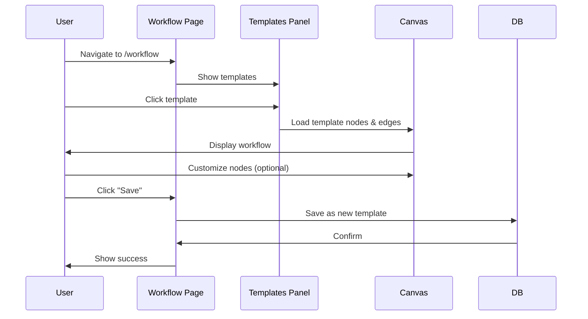
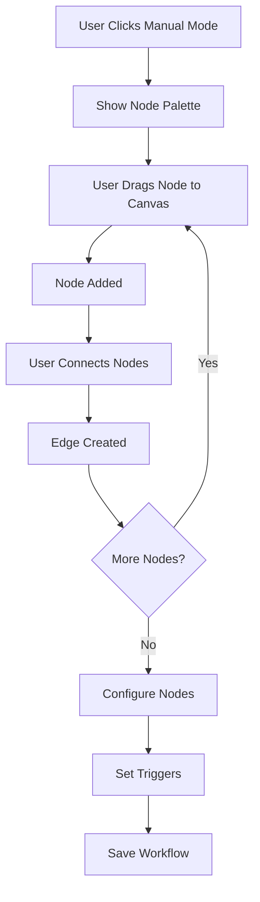
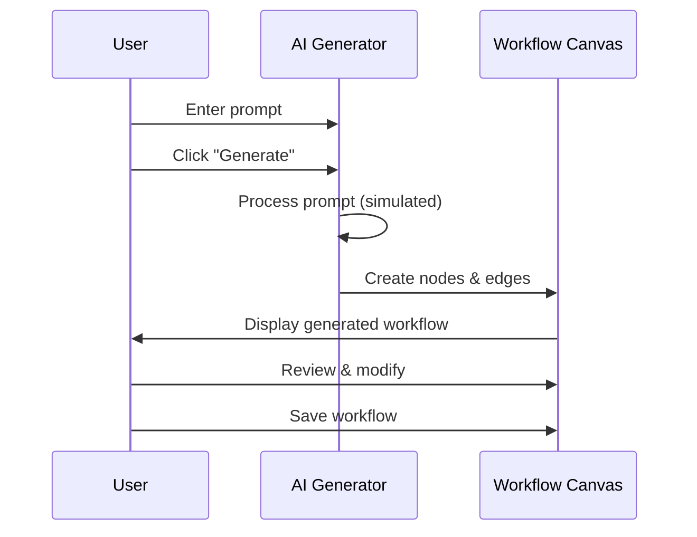
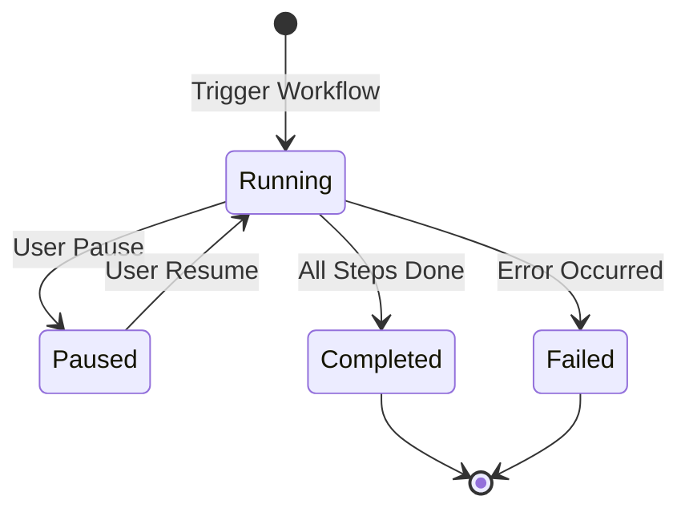

# Workflow Builder

## Feature Overview

### Purpose
Visual workflow automation system enabling users to design, template, and execute automated business processes for cell tower deployment and maintenance operations.

### Key Capabilities
- **3 Creation Modes**: Templates, Manual (drag-and-drop), AI-generated
- Visual node-based workflow designer using React Flow
- Pre-built workflow templates (Site Survey, Installation, Emergency Response)
- Node configuration with custom parameters
- Workflow execution and monitoring
- Template cloning and sharing

### User Roles & Permissions
- **View**: Users with `workflows.view` permission
- **Create/Edit**: Users with `workflows.create`, `workflows.edit` permissions
- **Execute**: Users with `workflows.execute` permission
- **Delete**: Users with `workflows.delete` permission

---

## Technical Architecture

### Component Hierarchy
```
Workflow.tsx (ReactFlowProvider)
└── WorkflowContent
    ├── Mode Selector (Templates/Manual/AI)
    ├── Left Sidebar
    │   ├── WorkflowTemplates
    │   ├── Node Palette (Manual mode)
    │   └── AI Generator (AI mode)
    ├── Main Canvas (ReactFlow)
    │   ├── Nodes
    │   ├── Edges
    │   ├── Background
    │   ├── Controls
    │   └── MiniMap
    └── Modals
        ├── WorkflowNodeEditor
        ├── WorkflowTriggers
        └── WorkflowExecutionPanel
```

### Dependencies
- **React Flow** - Visual workflow canvas
- **Zustand** - State management
- **Lucide React** - Icons

### State Management
```typescript
const {
  workflowTemplates,        // WorkflowTemplate[] - Available templates
  addWorkflowTemplate,      // Create new template
  deleteWorkflowTemplate,   // Delete template
  workflowExecutions       // WorkflowExecution[] - Execution history
} = useStore();

// Local state
const [nodes, setNodes, onNodesChange] = useNodesState(initialNodes);
const [edges, setEdges, onEdgesChange] = useEdgesState(initialEdges);
const [mode, setMode] = useState<'templates' | 'manual' | 'ai'>('templates');
```

### Key Files
- [`src/pages/Workflow.tsx`](file:///d:/telflow/teleflow/src/pages/Workflow.tsx) - Main workflow builder
- [`src/components/workflow/WorkflowTemplates.tsx`](file:///d:/telflow/teleflow/src/components/workflow/WorkflowTemplates.tsx) - Template library
- [`src/components/workflow/WorkflowNodeEditor.tsx`](file:///d:/telflow/teleflow/src/components/workflow/WorkflowNodeEditor.tsx) - Node configuration
- [`src/components/workflow/WorkflowTriggers.tsx`](file:///d:/telflow/teleflow/src/components/workflow/WorkflowTriggers.tsx) - Trigger setup
- [`src/components/workflow/WorkflowExecutionPanel.tsx`](file:///d:/telflow/teleflow/src/components/workflow/WorkflowExecutionPanel.tsx) - Execution monitor

---

## Database Schema

### `public.workflow_templates`
| Column | Type | Constraints | Description |
|--------|------|-------------|-------------|
| id | uuid | PK | Template ID |
| name | text | NOT NULL | Template name |
| description | text | | Template description |
| category | text | NOT NULL | maintenance/installation/survey/emergency/lease/rollout/custom |
| steps | jsonb | NOT NULL | Workflow definition (nodes + edges) |
| is_public | boolean | DEFAULT false | Public template |
| created_by | uuid | FK → users | Creator |
| created_at | timestamptz | DEFAULT now() | Creation time |
| updated_at | timestamptz | DEFAULT now() | Last update |

**Steps JSONB Structure**:
```json
{
  "nodes": [
    {
      "id": "node-1",
      "type": "start",
      "position": { "x": 250, "y": 25 },
      "data": {
        "label": "Start Process",
        "config": {}
      }
    },
    {
      "id": "node-2",
      "type": "task",
      "position": { "x": 250, "y": 125 },
      "data": {
        "label": "Assign Team",
        "config": {
          "assigneeRole": "team_lead",
          "autoAssign": true
        }
      }
    }
  ],
  "edges": [
    {
      "id": "edge-1-2",
      "source": "node-1",
      "target": "node-2",
      "animated": true
    }
  ]
}
```

### `public.workflow_executions`
| Column | Type | Constraints | Description |
|--------|------|-------------|-------------|
| id | uuid | PK | Execution ID |
| template_id | uuid | FK → workflow_templates | Template used |
| status | text | NOT NULL | running/completed/failed/paused |
| start_time | timestamptz | NOT NULL | Execution start |
| end_time | timestamptz | | Execution end |
| current_step | text | | Current node ID |
| variables | jsonb | | Runtime variables |
| triggered_by | uuid | FK → users | User who triggered |
| created_at | timestamptz | DEFAULT now() | Creation time |

---

## Node Types

### 1. Start Node (Input)
- **Type**: `input`
- **Icon**: Play
- **Color**: Blue (#3b82f6)
- **Config**: None
- **Description**: Workflow entry point

### 2. Task Node
- **Type**: `task`
- **Icon**: CheckCircle2
- **Color**: Emerald (#10b981)
- **Config**:
  - Task title
  - Assignee (user/role)
  - Due date offset
  - Auto-create task

### 3. Approval Node
- **Type**: `approval`
- **Icon**: CheckCircle2
- **Color**: Amber (#f59e0b)
- **Config**:
  - Approver (user/role)
  - Timeout duration
  - Auto-approve conditions

### 4. Condition Node
- **Type**: `condition`
- **Icon**: ArrowRightLeft
- **Color**: Purple (#8b5cf6)
- **Config**:
  - Condition expression
  - True path
  - False path

### 5. Notification Node
- **Type**: `notification`
- **Icon**: Send
- **Color**: Blue (#3b82f6)
- **Config**:
  - Recipients
  - Message template
  - Notification type

### 6. Delay Node
- **Type**: `delay`
- **Icon**: Clock
- **Color**: Slate (#64748b)
- **Config**:
  - Duration (hours/days)
  - Wait for condition

### 7. Document Node
- **Type**: `document`
- **Icon**: FileText
- **Color**: Indigo (#6366f1)
- **Config**:
  - Document template
  - Auto-generate
  - Required fields

### 8. AutoCAD AI Node
- **Type**: `autocad`
- **Icon**: Sparkles
- **Color**: Rose (#ec4899)
- **Config**:
  - AI analysis type
  - Output format

### 9. End Node (Output)
- **Type**: `output`
- **Icon**: CheckCircle
- **Color**: Green (#10b981)
- **Config**: None
- **Description**: Workflow completion

---

## Workflow Templates

### Site Survey Workflow
```json
{
  "id": "wt-site-survey",
  "name": "Site Survey Workflow",
  "category": "survey",
  "steps": {
    "nodes": [
      { "id": "1", "type": "start", "data": { "label": "Start Survey" } },
      { "id": "2", "type": "task", "data": { "label": "Assign Survey Team" } },
      { "id": "3", "type": "task", "data": { "label": "Conduct Site Visit" } },
      { "id": "4", "type": "task", "data": { "label": "Upload Photos & Data" } },
      { "id": "5", "type": "document", "data": { "label": "Generate Report" } },
      { "id": "6", "type": "approval", "data": { "label": "Manager Approval" } },
      { "id": "7", "type": "end", "data": { "label": "Complete Survey" } }
    ],
    "edges": [
      { "id": "e1-2", "source": "1", "target": "2" },
      { "id": "e2-3", "source": "2", "target": "3" },
      { "id": "e3-4", "source": "3", "target": "4" },
      { "id": "e4-5", "source": "4", "target": "5" },
      { "id": "e5-6", "source": "5", "target": "6" },
      { "id": "e6-7", "source": "6", "target": "7" }
    ]
  }
}
```

### Equipment Installation Workflow
```json
{
  "id": "wt-equipment-install",
  "name": "Equipment Installation",
  "category": "installation",
  "steps": {
    "nodes": [
      { "id": "1", "type": "start", "data": { "label": "Start Installation" } },
      { "id": "2", "type": "task", "data": { "label": "Order Equipment" } },
      { "id": "3", "type": "delay", "data": { "label": "Wait for Delivery" } },
      { "id": "4", "type": "task", "data": { "label": "Schedule Installation" } },
      { "id": "5", "type": "task", "data": { "label": "Install Equipment" } },
      { "id": "6", "type": "task", "data": { "label": "Test & Commission" } },
      { "id": "7", "type": "notification", "data": { "label": "Notify Completion" } },
      { "id": "8", "type": "end", "data": { "label": "Installation Complete" } }
    ]
  }
}
```

### Emergency Response Workflow
```json
{
  "id": "wt-emergency",
  "name": "Emergency Response",
  "category": "emergency",
  "steps": {
    "nodes": [
      { "id": "1", "type": "start", "data": { "label": "Emergency Triggered" } },
      { "id": "2", "type": "notification", "data": { "label": "Alert Team" } },
      { "id": "3", "type": "task", "data": { "label": "Dispatch Technician" } },
      { "id": "4", "type": "task", "data": { "label": "Assess Situation" } },
      { "id": "5", "type": "condition", "data": { "label": "Critical?" } },
      { "id": "6", "type": "notification", "data": { "label": "Escalate to Manager" } },
      { "id": "7", "type": "task", "data": { "label": "Resolve Issue" } },
      { "id": "8", "type": "document", "data": { "label": "File Report" } },
      { "id": "9", "type": "end", "data": { "label": "Emergency Resolved" } }
    ]
  }
}
```

---

## User Flows

### Create Workflow from Template


### Manual Workflow Creation


### AI Workflow Generation


### Workflow Execution


---

## API Integration

### Fetch Templates
```typescript
const { data, error } = await supabase
  .from('workflow_templates')
  .select('*')
  .order('created_at', { ascending: false });
```

### Save Template
```typescript
const { data, error } = await supabase
  .from('workflow_templates')
  .insert({
    name: 'My Workflow',
    description: 'Custom workflow',
    category: 'custom',
    steps: {
      nodes: nodes.map(n => ({
        id: n.id,
        type: n.type,
        position: n.position,
        data: n.data
      })),
      edges: edges.map(e => ({
        id: e.id,
        source: e.source,
        target: e.target,
        animated: e.animated
      }))
    },
    is_public: false,
    created_by: currentUser.id
  });
```

### Execute Workflow
```typescript
const { data, error } = await supabase
  .from('workflow_executions')
  .insert({
    template_id: templateId,
    status: 'running',
    start_time: new Date().toISOString(),
    variables: executionVariables,
    triggered_by: currentUser.id
  });
```

### Update Execution Status
```typescript
const { error } = await supabase
  .from('workflow_executions')
  .update({
    status: 'completed',
    end_time: new Date().toISOString(),
    current_step: null
  })
  .eq('id', executionId);
```

---

## React Flow Configuration

### Node Styling
```typescript
const nodeColor = (node: Node) => {
  switch (node.type) {
    case 'input': return '#3b82f6';   // Blue
    case 'output': return '#10b981';  // Green
    case 'task': return '#10b981';    // Emerald
    case 'approval': return '#f59e0b'; // Amber
    case 'condition': return '#8b5cf6'; // Purple
    default: return '#64748b';        // Slate
  }
};
```

### Edge Styling
```typescript
const defaultEdgeOptions = {
  animated: true,
  style: { stroke: '#64748b', strokeWidth: 2 },
  type: 'smoothstep'
};
```

### Canvas Controls
- **Zoom**: Mouse wheel or pinch
- **Pan**: Click and drag
- **Select**: Click node/edge
- **Multi-select**: Ctrl + Click
- **Delete**: Delete key

---

## Testing Checklist

- [ ] Can load and display workflow templates
- [ ] Drag-and-drop nodes work in manual mode
- [ ] Nodes connect with edges properly
- [ ] Node editor opens and saves configuration
- [ ] AI generation creates valid workflows
- [ ] Templates can be cloned
- [ ] Workflows can be saved as templates
- [ ] Execution panel shows running workflows
- [ ] Workflow triggers can be configured
- [ ] Canvas zoom and pan work smoothly
