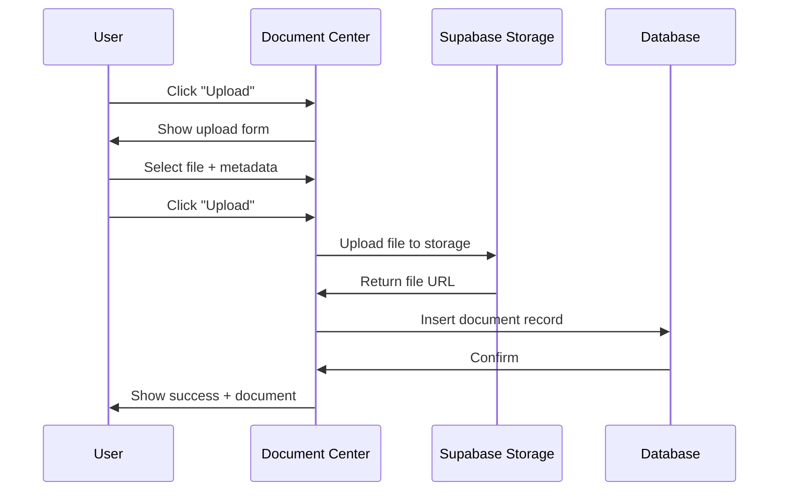

# Document Center

## Feature Overview

### Purpose
Centralized document management system with AutoCAD integration, version control, and AI-powered document analysis.

### Key Capabilities
- Document upload and storage
- Version control and history
- AutoCAD file integration
- AI-powered document analysis
- Document categorization and tagging
- Search and filtering
- Document linking to sites and tasks

### User Roles & Permissions
- **View**: Users with `documents.view` permission
- **Upload**: Users with `documents.upload` permission
- **Edit**: Users with `documents.edit` permission
- **Delete**: Users with `documents.delete` permission

---

## Database Schema

### `public.documents`
| Column | Type | Constraints | Description |
|--------|------|-------------|-------------|
| id | uuid | PK | Document ID |
| title | text | NOT NULL | Document title |
| description | text | | Document description |
| file_url | text | NOT NULL | Storage URL |
| file_type | text | NOT NULL | MIME type |
| file_size | bigint | | File size in bytes |
| category | text | NOT NULL | plans/reports/permits/photos/contracts |
| tags | text[] | | Document tags |
| site_id | uuid | FK → sites | Related site |
| task_id | uuid | FK → tasks | Related task |
| version | integer | DEFAULT 1 | Version number |
| parent_id | uuid | FK → documents | Parent document (for versions) |
| uploaded_by | uuid | FK → users | Uploader |
| created_at | timestamptz | DEFAULT now() | Upload time |
| updated_at | timestamptz | DEFAULT now() | Last update |

**Indexes:**
- `idx_documents_category` on `category`
- `idx_documents_site` on `site_id`
- `idx_documents_task` on `task_id`
- `idx_documents_tags` on `tags` (GIN index)

---

## Document Categories

| Category | Description | File Types |
|----------|-------------|------------|
| plans | Site plans, blueprints | PDF, DWG, DXF |
| reports | Survey reports, analysis | PDF, DOCX |
| permits | Permits and licenses | PDF |
| photos | Site photos | JPG, PNG |
| contracts | Lease agreements | PDF, DOCX |

---

## AutoCAD Integration

### Supported Formats
- DWG (AutoCAD Drawing)
- DXF (Drawing Exchange Format)

### AI Analysis Features
- Layer extraction
- Dimension detection
- Equipment placement analysis
- Compliance checking

---

## User Flows

### Upload Document Flow


---

## API Integration

### Upload Document
```typescript
// Upload file to storage
const { data: fileData, error: uploadError } = await supabase.storage
  .from('documents')
  .upload(`${userId}/${fileName}`, file);

// Create document record
const { data, error } = await supabase
  .from('documents')
  .insert({
    title: fileName,
    file_url: fileData.path,
    file_type: file.type,
    file_size: file.size,
    category: 'plans',
    uploaded_by: userId
  });
```

### Fetch Documents
```typescript
const { data, error } = await supabase
  .from('documents')
  .select(`
    *,
    site:sites(name),
    uploader:users!uploaded_by(name)
  `)
  .order('created_at', { ascending: false });
```

---

## Testing Checklist
- [ ] Can upload documents of all supported types
- [ ] Version control creates new versions correctly
- [ ] AutoCAD files display preview
- [ ] Search finds documents by title and tags
- [ ] Document linking to sites/tasks works
- [ ] Download functionality works
