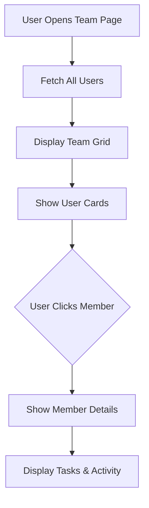

# Team Management

## Feature Overview

### Purpose
Manage team members, view team workload, and facilitate collaboration across the organization.

### Key Capabilities
- View team members and their roles
- Monitor team workload and task distribution
- Team member profiles with contact information
- Activity tracking
- Team-based filtering and reporting

### User Roles & Permissions
- **View**: Users with `team.view` permission
- **Invite**: Users with `team.invite` permission
- **Edit**: Users with `team.edit` permission
- **Remove**: Users with `team.remove` permission

---

## Database Schema

Uses the `public.users` table (see Authentication documentation).

---

## User Flows

### View Team Flow


---

## API Integration

### Fetch Team Members
```typescript
const { data, error } = await supabase
  .from('users')
  .select('*')
  .order('name', { ascending: true });
```

### Get Member Workload
```typescript
const { data, error } = await supabase
  .from('tasks')
  .select('id, title, status, priority')
  .eq('assignee_id', userId);
```

---

## Testing Checklist
- [ ] Team members display with correct information
- [ ] Workload metrics calculate correctly
- [ ] Member profiles show complete information
- [ ] Activity feed displays recent actions
