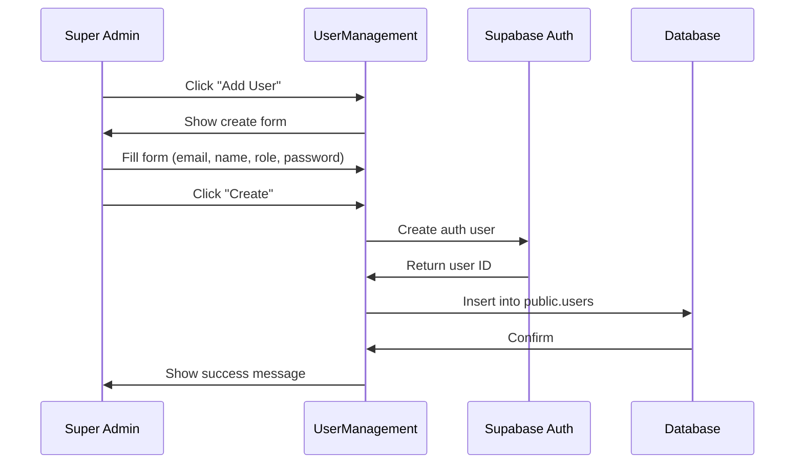

# User Management (Super Admin)

## Feature Overview

### Purpose
Super admin interface for creating and managing user accounts, assigning roles, and managing permissions.

### Key Capabilities
- Create new user accounts
- Assign roles to users
- Manage custom permissions
- View all users in the system
- Deactivate/reactivate users

### User Roles & Permissions
- **Access**: Super Admin only (`super_admin` role)
- **Required Permission**: `users.manage_permissions`

---

## Database Schema

Uses tables from Authentication system:
- `auth.users` - Supabase auth users
- `public.users` - User profiles
- `public.user_custom_permissions` - Custom permission overrides

---

## User Flows

### Create User Flow


---

## API Integration

### Create User
```typescript
// Create auth user
const { data: authData, error: authError } = await supabase.auth.admin.createUser({
  email: email,
  password: password,
  email_confirm: true
});

// Create user profile
const { data, error } = await supabase
  .from('users')
  .insert({
    id: authData.user.id,
    name: name,
    email: email,
    role: role
  });
```

### Fetch All Users
```typescript
const { data, error } = await supabase
  .from('users')
  .select('*')
  .order('created_at', { ascending: false });
```

### Update User Role
```typescript
const { error } = await supabase
  .from('users')
  .update({ role: newRole })
  .eq('id', userId);
```

---

## Testing Checklist
- [ ] Super admin can create users
- [ ] Users can login with created credentials
- [ ] Role assignment works correctly
- [ ] Custom permissions can be assigned
- [ ] User list displays all users
- [ ] User deactivation works
